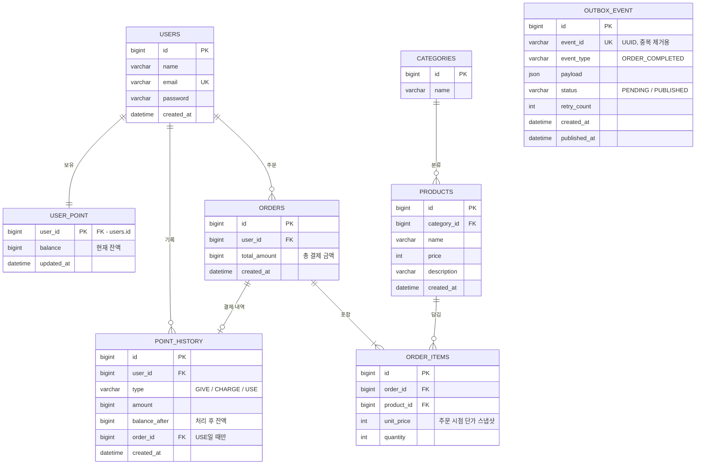

# ☕ 커피숍 주문 시스템
다수 서버 환경에서도 안정적으로 동작하는 커피 주문 시스템입니다.

## 0. 문제 해결 전략 수립
### 요구사항 분석

<b>모든 기능에 공통으로 적용되는 전제</b>
> **"애플리케이션 서버는 여러 대가 동시에 뜬다."**
> 따라서 `synchronized`, 서버 메모리 변수, 로컬 캐시처럼 **한 JVM 안에서만 유효한 수단으로는 정합성을 보장할 수 없습니다.**
> 정합성의 기준(Single Source of Truth)은 모든 서버가 공유하는 **DB**로 둡니다.

 

**"무엇이 깨지면 안 되는가"**
| 기능 | 깨지면 안 되는 것 | 핵심 위험 |
|---|---|---|
| 메뉴 목록 조회 | 모든 서버가 같은 메뉴를 보여줘야 함 | 서버별 로컬 캐시 불일치 |
| 포인트 충전 | 충전한 만큼 정확히 늘어나야 함 | 동시 충전 시 Lost Update, 중복 요청 |
| 주문/결제 | 잔액 이상 결제 불가, 결제와 주문은 함께 성공/실패 | 동시 주문 시 잔액 초과 차감, 부분 실패 |
| 데이터 플랫폼 전송 | 커밋된 주문만, 빠짐없이 전송 | 롤백된 주문 전송, 전송 실패로 인한 유실 |
| 인기 메뉴 조회 | 주문 횟수가 정확해야 함 | 집계 누락/중복, 대용량 집계 쿼리 부하 |

 

**각 저장소의 역할**
 
| 저장소 | 역할 | 데이터가 사라지면? |
|---|---|---|
| MySQL | 사용자, 포인트, 주문, Outbox의 **원본** | 복구 불가 → 원본이므로 가장 중요 |
| Redis | 메뉴 캐시, 충전 멱등성 키, 인기 메뉴 랭킹 | MySQL 주문 데이터로 **재구축 가능** |
| Kafka | 주문 완료 이벤트를 여러 소비자에게 전달 | Outbox에 원본이 남아 있으므로 **재발행 가능** |
 
Redis와 Kafka는 모두 "잃어도 MySQL에서 되살릴 수 있는" 데이터만 다루도록 설계했습니다. 이것이 세 저장소를 함께 쓰면서도 정합성을 지킬 수 있는 기준입니다.

 

### 설계 내용
 
#### ERD
 

#### 테이블 설계 의도
 
**`USER_POINT`를 `USERS`에서 분리한 이유**
포인트 차감 시 행에 락을 걸게 되는데, 잔액이 `USERS`에 있으면 결제 중에는 닉네임 변경 같은 무관한 수정까지 대기하게 됩니다. 락이 걸리는 범위를 **돈과 관련된 데이터로만 좁히기 위해** 분리했습니다.
 
**`POINT_HISTORY`와 포인트 유형**
잔액만 있으면 "왜 이 금액이 되었는지" 추적할 수 없으므로 모든 변동을 기록합니다. 유형은 다음 세 가지입니다.
 
| type | 의미 | amount | order_id |
|---|---|---|---|
| `CHARGE` | 사용자가 직접 충전 | 양수 | `NULL` |
| `GIVE` | 이벤트 보상, 운영자 지급 | 양수 | `NULL` |
| `USE` | 주문 결제 | 양수(차감액) | 주문 ID |
 
`CHARGE`와 `GIVE`를 구분한 이유는 **돈을 내고 산 포인트와 무상으로 받은 포인트는 회계적으로 다르게 다뤄야 하기 때문**입니다. 환불이나 정산 시 이 구분이 필요합니다. 운영자 지급 API는 과제 필수 범위 밖이므로, 도메인 유형만 정의하고 충전과 같은 락·이력 로직을 재사용하도록 설계했습니다.
 
**`ORDERS`와 `ORDER_ITEMS`를 나눈 이유**
한 주문에 여러 메뉴를 담을 수 있도록 **주문 단위 정보**(누가, 언제, 총 얼마)와 **상품 단위 정보**(무엇을, 얼마에, 몇 개)를 분리했습니다.
- `ORDER_ITEMS.unit_price`: 메뉴 가격은 나중에 바뀔 수 있으므로 **주문 시점 단가를 스냅샷**으로 저장합니다. 가격은 상품마다 다르므로 `ORDERS`가 아닌 `ORDER_ITEMS`에 둡니다.
- `ORDERS.total_amount`: 포인트 차감액과 바로 대조할 수 있도록 총액을 저장합니다.
**`OUTBOX_EVENT`를 두는 이유**
주문 이벤트를 Kafka로 빠짐없이 보내기 위한 테이블입니다. `event_id`(UUID)는 Kafka 소비자들이 중복 메시지를 걸러내는 기준이 됩니다. (0-5 ③ 참고)
 
**인기 메뉴 집계 테이블을 두지 않은 이유**
집계는 Kafka 소비자가 Redis Sorted Set에 반영합니다. 대신 원본인 `ORDERS`·`ORDER_ITEMS`로 언제든 재계산할 수 있으므로, Redis 데이터가 유실되어도 복구할 수 있습니다. (0-5 ④ 참고)
 
**인덱스**
- `orders(created_at)` — Redis 랭킹 재구축 시 최근 7일 주문 조회
- `order_items(order_id)` — 주문별 상품 조회
- `point_history(user_id, created_at)` — 사용자별 포인트 내역 조회
- `outbox_event(status, created_at)` — Relay가 미발행 이벤트를 찾을 때 사용
---
