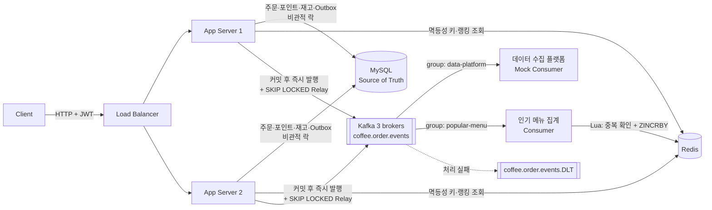
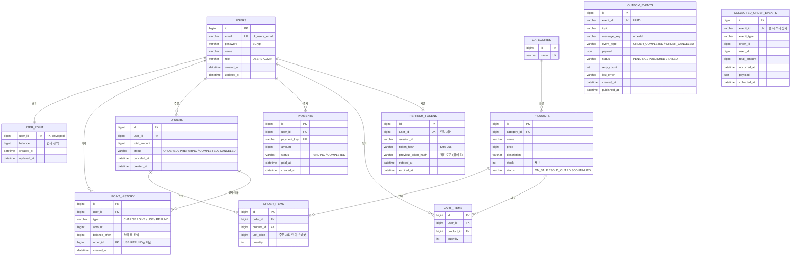

# ☕ 커피숍 주문 시스템

다수 서버 환경에서도 안정적으로 동작하는 커피 주문 시스템입니다.
이 문서는 **무엇을 만들었는지**보다 **왜 이렇게 설계했는지**를 설명하는 데 초점을 둡니다.

> [Spring 5기] CH6 실전 — K사 서버 개발 과제

---

## 목차

- [기술 스택](#기술-스택)
- [실행 방법](#실행-방법)
- [0. 문제 해결 전략 수립](#0-문제-해결-전략-수립)
  - [0-1. 요구사항 분석](#0-1-요구사항-분석)
  - [0-2. 전체 아키텍처](#0-2-전체-아키텍처)
  - [0-3. 설계 내용 (ERD, API 명세)](#0-3-설계-내용)
  - [0-4. 설계의 의도](#0-4-설계의-의도)
  - [0-5. 문제 해결 전략 및 분석 내용](#0-5-문제-해결-전략-및-분석-내용)
  - [0-6. 기술적 선택 이유](#0-6-기술적-선택-이유)
- [테스트 전략과 결과](#테스트-전략과-결과)
- [다중 서버·장애 검증](#다중-서버장애-검증)
- [알려진 한계와 트레이드오프](#알려진-한계와-트레이드오프)
- [향후 개선](#향후-개선)
- [트러블슈팅 기록](#트러블슈팅-기록)

---

## 기술 스택

| 구분 | 기술 |
|---|---|
| Language / Framework | Java 17, Spring Boot 4 (Spring Framework 7), Spring Security, Spring Data JPA, QueryDSL |
| ORM | Hibernate 7 |
| Database | MySQL 8 |
| Cache / In-memory | Redis 7.4 (AOF 영속화) |
| Message Broker | Apache Kafka 3.7 — 브로커 3대 KRaft 클러스터 |
| Serialization | Jackson 3 (`tools.jackson.*`) |
| Auth | JWT (jjwt 0.12), Access + Refresh Token Rotation |
| Infra (local) | Docker Compose — Redis, Kafka ×3, Kafka UI, RedisInsight |
| Test | JUnit 5, AssertJ, Awaitility |

---

## 실행 방법

### 1. 인프라 실행

```bash
docker compose up -d
docker compose ps        # redis, kafka-1~3, kafka-ui, redis-insight 가 모두 running 인지 확인
```

| 도구 | 주소 | 용도 |
|---|---|---|
| Kafka UI | http://localhost:8088 | 토픽·메시지·컨슈머 그룹 Lag 확인 |
| RedisInsight | http://localhost:5540 | Redis 키 확인 (연결 Host: `redis`, Port: `6379`) |

MySQL은 로컬에 설치된 MySQL 8을 사용합니다 (`coffee_db`).

### 2. 환경 변수

| 변수 | 설명 | 예시 |
|---|---|---|
| `SPRING_PROFILES_ACTIVE` | 프로필 | `local` |
| `DB_PASSWORD` | MySQL 비밀번호 | |
| `JWT_SECRET` | JWT 서명 키 (Base64, 256bit 이상) | |
| `DDL_AUTO` | 테이블 생성 전략 (기본 `create`) | 두 번째 서버는 `none` |
| `SQL_INIT_MODE` | `data.sql` 실행 여부 (기본 `always`) | 두 번째 서버는 `never` |

### 3. 서버 실행

```bash
./gradlew bootRun
```

로컬 프로필은 `ddl-auto: create`이므로 서버를 시작할 때마다 테이블이 초기화되고 `data.sql`의 테스트 상품 15개가 들어갑니다.

**서버 2대 실행 (다중 서버 검증용)**

```
서버 1: 기본 설정                                      → :8080 (테이블 생성 담당)
서버 2: DDL_AUTO=none, SQL_INIT_MODE=never, --server.port=8081   → :8081
```

---

# 0. 문제 해결 전략 수립

## 0-1. 요구사항 분석

### 무엇이 깨지면 안 되는가

요구사항을 기능 단위가 아니라 **"무엇이 깨지면 안 되는가"** 기준으로 다시 정리했습니다.

| 기능 | 깨지면 안 되는 것 | 핵심 위험 |
|---|---|---|
| 메뉴 목록 조회 | 모든 서버가 같은 메뉴·가격을 보여줘야 함 | 서버별 로컬 캐시 불일치 |
| 포인트 충전 | 충전한 만큼 정확히 늘어나야 함 | 동시 충전 시 Lost Update, 재시도로 인한 중복 충전 |
| 주문/결제 | 잔액·재고 이상 판매 불가, 결제와 주문은 함께 성공/실패 | 동시 주문 시 초과 차감, 부분 실패 |
| 데이터 플랫폼 전송 | 커밋된 주문만, 빠짐없이, 한 번씩 | 롤백된 주문 전송, 전송 실패로 인한 유실, 중복 적재 |
| 인기 메뉴 조회 | 메뉴별 주문 수가 정확해야 함 | 집계 누락·중복, 취소 반영 누락, 대용량 집계 쿼리 부하 |

모든 기능에 공통으로 적용되는 전제가 있습니다.

> **"애플리케이션 서버는 여러 대가 동시에 뜬다."**
> 따라서 `synchronized`, 서버 메모리 변수, 로컬 캐시처럼 **한 JVM 안에서만 유효한 수단으로는 정합성을 보장할 수 없습니다.**
> 모든 서버가 공유하는 저장소(MySQL, Redis, Kafka)에서만 상태를 관리하고, 그중 **원본 데이터(Source of Truth)는 MySQL**로 둡니다.

### 요구사항 해석과 확장

과제의 요구사항이 열려 있는 부분은 다음과 같이 해석했습니다.

| 항목 | 해석 / 결정 | 이유 |
|---|---|---|
| 사용자 식별값 | 요청 본문이 아니라 **JWT 액세스 토큰**에서 추출 | 본문으로 받으면 다른 사용자의 포인트로 결제하는 요청을 막을 수 없음 |
| 주문 단위 | 한 주문에 **여러 메뉴·수량** | 실제 커피 주문은 여러 잔을 한 번에 주문 |
| 재고 | 상품별 재고 관리, 0이 되면 자동 `SOLD_OUT` | 한정 메뉴처럼 수량이 정해진 상품에서 동시성 문제가 실제로 발생 |
| 주문 취소 | 제조 시작 전(`ORDERED`)까지 취소 가능, 포인트 환불 + 재고 복구 | 인기 메뉴의 "정확한 주문 횟수"에 취소가 반영되어야 함 |
| 포인트 충전 | 결제(가짜 게이트웨이)를 거쳐야만 충전 | 결제 기록 없이 포인트가 늘어나는 경로를 차단 |
| "인기 메뉴" 기준 | 최근 7일 **판매 수량(잔 수)** 합계, 취소분 제외 | 메뉴 인기를 가장 직접적으로 나타내는 지표 |

---

## 0-2. 전체 아키텍처



### 각 저장소의 역할

| 저장소 | 역할 | 데이터가 사라지면? |
|---|---|---|
| MySQL | 사용자, 포인트, 재고, 주문, 결제, Outbox의 **원본** | 복구 불가 → 원본이므로 가장 중요 |
| Redis | 멱등성 키, 인기 메뉴 일별 랭킹 | 랭킹은 MySQL 주문 데이터로 **재구축 가능** |
| Kafka | 주문 이벤트를 여러 소비자에게 전달 | Outbox에 원본이 남아 있으므로 **재발행 가능** |

Redis와 Kafka는 모두 **"잃어도 MySQL에서 되살릴 수 있는" 데이터만** 다루도록 설계했습니다. 세 저장소를 함께 쓰면서도 "어디가 진짜 데이터인가"가 흔들리지 않게 하기 위한 기준입니다.

### 주문 하나의 흐름

```
POST /api/orders
 └ [Redis] 멱등성 키 SET NX
   └ [MySQL 트랜잭션]
       ├ 상품 행 락 (id 오름차순) → 재고 차감, 0이면 SOLD_OUT
       ├ 주문·주문 항목 저장 (주문 시점 단가 스냅샷)
       ├ 포인트 행 락 → 잔액 차감 + USE 이력
       └ Outbox 이벤트 저장 (ORDER_COMPLETED)
     커밋
 └ [비동기] Outbox → Kafka 즉시 발행 → PUBLISHED
                       ├ data-platform → collected_order_events (eventId 중복 제거)
                       └ popular-menu  → Redis popular:products:{주문일} (Lua 원자 처리)
```

---

## 0-3. 설계 내용

### ERD



> `COLLECTED_ORDER_EVENTS`는 외부 데이터 수집 플랫폼을 흉내 내는 Mock 테이블입니다. 주문 테이블과 FK로 연결하지 않았습니다 (아래 설명 참고).

### 테이블 설계 의도

**`USER_POINT`를 `USERS`에서 분리한 이유**
포인트 차감 시 행에 락을 겁니다. 잔액이 `USERS`에 있으면 결제 중에는 이름 변경 같은 무관한 수정까지 대기하게 됩니다. 락이 걸리는 범위를 **돈과 관련된 데이터로만 좁히기 위해** 분리했고, `@MapsId`로 PK를 `user_id`와 공유해 1:1 관계를 보장했습니다. 지갑은 회원가입과 같은 트랜잭션에서 함께 생성됩니다.

**`POINT_HISTORY`와 포인트 유형**
잔액만 있으면 "왜 이 금액이 되었는지" 추적할 수 없으므로 모든 변동을 기록합니다.

| type | 의미 | order_id |
|---|---|---|
| `CHARGE` | 결제를 거친 충전 | `NULL` |
| `GIVE` | 운영자 지급, 이벤트 보상 | `NULL` |
| `USE` | 주문 결제 | 주문 ID |
| `REFUND` | 주문 취소 환불 | 주문 ID |

- `CHARGE`와 `GIVE`를 구분한 이유: 돈을 내고 산 포인트와 무상 포인트는 정산·환불 시 다르게 다뤄야 합니다.
- **`(order_id, type)` 유니크 제약**: 한 주문의 결제(`USE`)와 환불(`REFUND`)은 각각 한 번만 존재할 수 있습니다. 코드의 상태 검사를 뚫는 버그가 있어도 **DB가 이중 환불을 최종적으로 막는 안전장치**입니다.

**`PAYMENTS`를 둔 이유**
포인트 충전은 반드시 결제를 거쳐야 합니다. `PointService.charge()`는 트랜잭션 전파를 `MANDATORY`로 두어 **결제 트랜잭션 안에서만 호출 가능**하게 했습니다. 결제 기록 없이 포인트가 늘어나는 경로가 코드 수준에서 차단됩니다.

**`ORDERS`와 `ORDER_ITEMS`를 나눈 이유**
- `ORDER_ITEMS.unit_price`: 메뉴 가격은 나중에 바뀔 수 있으므로 **주문 시점 단가를 스냅샷**으로 저장합니다.
- `ORDERS.status`: 취소 가능 여부를 결정합니다 (`ORDERED`에서만 취소 가능).

**`PRODUCTS.stock`과 `status`**
재고가 0이 되면 같은 트랜잭션에서 `SOLD_OUT`으로 바뀌고, 취소로 재고가 복구되면 `ON_SALE`로 돌아옵니다. `DISCONTINUED`(판매 종료)는 메뉴 목록과 인기 메뉴에서 제외됩니다.

**`REFRESH_TOKENS`**
토큰 원문이 아니라 **해시만 저장**합니다 (DB가 유출되어도 토큰을 쓸 수 없도록). `user_id` 유니크로 사용자당 세션 하나만 유지하고, `previous_token_hash`·`rotated_at`으로 동시 재발급의 유예와 재사용 탐지를 구현합니다 (0-5 ⑨).

**`OUTBOX_EVENTS`**
주문 이벤트를 Kafka로 빠짐없이 보내기 위해 **주문과 같은 트랜잭션**에 저장하는 테이블입니다. `event_id`는 소비자가 중복을 걸러내는 기준입니다 (0-5 ③).

**`COLLECTED_ORDER_EVENTS`에 FK가 없는 이유**
데이터 플랫폼은 **외부 시스템**이라는 가정이므로, 주문 서버의 테이블에 의존하지 않고 Kafka 메시지(JSON)만으로 동작하도록 했습니다.

**인기 메뉴 집계 테이블을 두지 않은 이유**
집계는 Redis Sorted Set에서 하고, 원본인 `ORDERS`·`ORDER_ITEMS`로 언제든 재계산할 수 있습니다 (0-5 ⑦).

**유니크 제약에 이름을 붙인 이유**
`uk_users_email`, `uk_collected_event_id`처럼 이름을 지정하고, `DataIntegrityViolationException`이 **어느 제약 때문인지** 이름으로 판별합니다. 이름 없이 "제약 위반 = 중복"으로 처리하면 NOT NULL 위반 같은 다른 원인이 엉뚱한 에러로 둔갑합니다 (실제로 겪은 문제 — [트러블슈팅](#트러블슈팅-기록) 참고).

### 인덱스

| 인덱스 | 사용처 |
|---|---|
| `orders(user_id, created_at)` | 내 주문 목록 (최신순 페이지) |
| `order_items(order_id)` | 주문별 상품 조회 |
| `payments(user_id, created_at)` | 내 결제 내역 |
| `point_history(order_id, type)` UNIQUE | 결제·환불 1회 보장 |
| `cart_items(user_id, product_id)` UNIQUE | 같은 상품은 장바구니에 한 줄 |
| `outbox_events(status, created_at)` | Relay가 미발행 이벤트를 찾을 때 |
| `collected_order_events(event_id)` UNIQUE | 중복 적재 방지 |

---

### API 명세

#### 공통 응답 형식

```json
// 성공
{ "code": "SUCCESS", "data": { ... } }

// 실패
{ "code": "POINT_002", "message": "포인트가 부족합니다." }
```

#### 인증

로그인 시 **액세스 토큰은 응답 본문**, **리프레시 토큰은 `HttpOnly` 쿠키**(`Path=/api/auth`)로 전달합니다. 이후 요청은 `Authorization: Bearer {accessToken}` 헤더를 사용합니다.

#### 엔드포인트 목록

| 구분 | Method | URL | 인증 | 비고 |
|---|---|---|---|---|
| 인증 | POST | `/api/auth/signup` | - | 회원가입 + 포인트 지갑 생성 |
| | POST | `/api/auth/login` | - | |
| | POST | `/api/auth/reissue` | 쿠키 | 리프레시 토큰 Rotation |
| | POST | `/api/auth/logout` | 쿠키 | |
| **① 메뉴** | GET | `/api/products` | - | `categoryId`, `keyword`, `page`, `size`, `sort` |
| **④ 인기 메뉴** | GET | `/api/products/popular` | - | 최근 7일 상위 3개 |
| **② 충전** | POST | `/api/payments/charge` | ✅ | **`Idempotency-Key` 필수** |
| | GET | `/api/payments` | ✅ | 내 결제 내역 |
| 포인트 | GET | `/api/points` | ✅ | 잔액 |
| | GET | `/api/points/histories` | ✅ | 변동 이력 |
| **③ 주문** | POST | `/api/orders` | ✅ | **`Idempotency-Key` 필수** |
| | GET | `/api/orders` | ✅ | 내 주문 목록 (페이지) |
| | GET | `/api/orders/{orderId}` | ✅ | 주문 상세 |
| | POST | `/api/orders/{orderId}/cancel` | ✅ | 주문 취소 |
| 장바구니 | GET | `/api/cart/items` | ✅ | 구매 가능 여부(`purchasable`) 포함 |
| | POST | `/api/cart/items` | ✅ | |
| | PATCH | `/api/cart/items/{cartItemId}` | ✅ | 수량을 **절대값**으로 변경 |
| | DELETE | `/api/cart/items/{cartItemId}` | ✅ | 멱등 삭제 |
| | DELETE | `/api/cart/items` | ✅ | 본문 `{ "cartItemIds": [...] }` |
| 회원 | GET | `/api/users/me` | ✅ | |
| 관리자 | POST | `/api/admin/popular-menus/rebuild` | ADMIN | 인기 메뉴 랭킹 재구축 |

#### 필수 API 상세

**1) 커피 메뉴 목록 조회** — `GET /api/products`

```
GET /api/products?categoryId=1&keyword=라떼&page=0&size=20
```

- 메뉴 ID, 이름, 가격, 카테고리, 판매 상태를 페이지로 반환합니다.
- `categoryId`, `keyword`는 선택 조건이며, 주어진 조건만 동적으로 적용합니다 (QueryDSL).
- 판매 종료(`DISCONTINUED`) 메뉴는 제외하고, 품절(`SOLD_OUT`)은 상태와 함께 노출합니다.
- 누구나 볼 수 있는 정보라 로그인 없이 조회할 수 있습니다.

**2) 포인트 충전** — `POST /api/payments/charge`

```
Authorization: Bearer {accessToken}
Idempotency-Key: 3f2a9c1e-...     ← 클라이언트가 요청마다 생성한 UUID
```

```json
{ "amount": 10000 }
```

- 1원 = 1P, 1회 최대 1,000,000원.
- **`POST` + `Idempotency-Key`**: 같은 요청이 두 번 오면 두 번 충전되는 멱등하지 않은 연산입니다. 버튼 중복 클릭이나 타임아웃 재시도를 서버가 정상 요청 두 건과 구분할 수 있도록, **같은 키는 한 번만 처리하고 이후에는 첫 결과를 그대로 반환**합니다.
- 흐름: 가짜 결제 게이트웨이 승인 → `PAYMENTS` 저장 → `USER_POINT` 락 → 잔액 증가 + `CHARGE` 이력 (하나의 트랜잭션).

**3) 커피 주문/결제** — `POST /api/orders`

```
Authorization: Bearer {accessToken}
Idempotency-Key: 7b1d...
```

```json
// Request
{
  "items": [
    { "productId": 1, "quantity": 2 },
    { "productId": 13, "quantity": 1 }
  ]
}

// 201 Created
{
  "code": "SUCCESS",
  "data": {
    "order": {
      "orderId": 1,
      "status": "ORDERED",
      "items": [
        { "productId": 1, "name": "아메리카노", "unitPrice": 4500, "quantity": 2, "amount": 9000 },
        { "productId": 13, "name": "치즈케이크", "unitPrice": 6500, "quantity": 1, "amount": 6500 }
      ],
      "totalAmount": 15500,
      "orderedAt": "2026-10-06T16:20:11.123",
      "canceledAt": null
    },
    "remainingPoint": 34500
  }
}
```

- 사용자 식별값은 토큰에서 꺼내므로 본문에 없습니다.
- 같은 `productId`가 여러 번 들어오면 수량을 합쳐 하나로 처리합니다. 수량은 상품당 1~99.
- 커밋 후 데이터 수집 플랫폼으로 **사용자 ID, 메뉴 ID, 결제 금액**이 담긴 이벤트가 전송됩니다 (0-5 ③④).

**주문 취소** — `POST /api/orders/{orderId}/cancel`

- `ORDERED` 상태만 취소 가능 → 포인트 환불(`REFUND`) + 재고 복구 + `ORDER_CANCELED` 이벤트.
- 본문과 멱등성 키가 필요 없습니다. 주문 상태 자체가 한 번만 바뀌도록 막혀 있기 때문입니다.

**4) 인기 메뉴 목록 조회** — `GET /api/products/popular`

```json
{
  "code": "SUCCESS",
  "data": [
    { "rank": 1, "productId": 1, "name": "아메리카노", "price": 4500, "orderCount": 7, "status": "ON_SALE" },
    { "rank": 2, "productId": 13, "name": "치즈케이크", "price": 6500, "orderCount": 3, "status": "ON_SALE" },
    { "rank": 3, "productId": 8, "name": "딸기라떼", "price": 6000, "orderCount": 1, "status": "SOLD_OUT" }
  ]
}
```

| 정의 | 결정 |
|---|---|
| 최근 7일 | 오늘을 포함한 7일 (`D-6 ~ D`), 한국 시간 기준 날짜 |
| 주문 횟수 | 판매된 **잔 수(quantity 합)**, 취소분 차감 |
| 날짜 기준 | **주문 시각** (어제 주문을 오늘 취소하면 어제 집계에서 뺌) |
| 동점 | 상품 ID 오름차순 (요청마다 순서가 같도록 고정) |
| 제외 | 순 판매 0 이하, 판매 종료 메뉴. 품절은 순위에 남기고 `status`로 표시 |
| 3개 미만 | 있는 만큼만 반환 |

#### 에러 코드

| 코드 | HTTP | 상황 |
|---|---|---|
| `COMMON_001` | 400 | 입력값 형식 오류, 필수 헤더(`Idempotency-Key`) 누락 |
| `COMMON_002` | 500 | 서버 내부 오류 |
| `COMMON_003` | 409 | 같은 멱등성 키의 요청이 아직 처리 중 |
| `COMMON_004` | 404 | 존재하지 않는 경로 |
| `COMMON_005` | 409 | 락 대기 시간(3초) 초과 |
| `AUTH_001` / `AUTH_002` | 401 / 403 | 인증 필요 / 권한 없음 |
| `AUTH_003` | 401 | 이메일 또는 비밀번호 불일치 |
| `AUTH_004` / `AUTH_005` | 401 | 액세스 토큰 만료 / 유효하지 않은 토큰 |
| `AUTH_006` / `AUTH_007` | 401 | 리프레시 토큰 무효 / 만료 |
| `AUTH_008` | 401 | 리프레시 토큰 재사용 탐지 → 세션 폐기 |
| `AUTH_009` | 409 | 동시 재발급 경쟁에서 짐 (세션은 유지) |
| `USER_001` / `USER_002` | 404 / 409 | 회원 없음 / 이메일 중복 |
| `POINT_001` | 400 | 충전 금액 오류 (0 이하, 1회 한도 초과) |
| `POINT_002` | 400 | 포인트 부족 |
| `PRODUCT_001` | 404 | 상품 없음 |
| `PRODUCT_002` | 409 | 재고 부족 |
| `PRODUCT_003` | 409 | 판매하지 않는 상품 (품절·판매 종료) |
| `CART_001` | 404 | 장바구니 항목 없음 |
| `ORDER_001` | 404 | 주문 없음 (다른 사용자의 주문 포함) |
| `ORDER_003` | 409 | 제조가 시작되어 취소 불가 |
| `ORDER_004` | 400 | 수량 오류 |
| `ORDER_005` | 409 | 이미 취소된 주문 |

- 클라이언트는 `code`로 분기하므로 **코드는 서로 겹치지 않게** 관리합니다 (예: `AUTH_004`면 재발급, `AUTH_007`이면 로그인 화면).
- 다른 사용자의 주문에 접근하면 403이 아니라 **404**를 반환합니다. 403은 "그 주문이 존재한다"는 정보를 노출하기 때문입니다.

---

## 0-4. 설계의 의도

**1. 원본은 MySQL, Redis와 Kafka는 파생 데이터**
Redis 랭킹은 주문 테이블로, Kafka 메시지는 Outbox 테이블로 다시 만들 수 있습니다. 새 인프라를 도입하면서도 **"어디가 진짜 데이터인가"가 흔들리지 않도록** 했습니다.

**2. 애플리케이션 서버는 상태를 갖지 않는다 (Stateless)**
세션, 로컬 캐시, 메모리 카운터를 쓰지 않습니다. 인증은 JWT, 멱등성 키와 랭킹은 Redis, 락은 MySQL에 있습니다. 어느 서버로 요청이 가든 같은 결과가 나와야 서버를 자유롭게 늘릴 수 있기 때문입니다.

**3. 함께 성공해야 하는 것은 하나의 트랜잭션으로 묶는다**
"재고 차감 + 주문 저장 + 포인트 차감 + 포인트 이력 + Outbox 이벤트"는 하나라도 빠지면 데이터가 어긋나므로 **하나의 DB 트랜잭션**입니다.

**4. 느리거나 실패할 수 있는 작업은 주문 흐름에서 분리한다**
데이터 플랫폼 전송과 인기 메뉴 집계가 느리거나 실패한다고 **사용자의 주문까지 실패하면 안 되므로**, Kafka를 통해 비동기로 처리합니다. 대신 이 부분은 **최종 일관성**(수백 ms~수 초 지연)을 받아들입니다.

**5. 중복은 "막는 곳"과 "걸러내는 곳"을 모두 둔다**
분산 환경에서 "정확히 한 번 전달"은 보장하기 어렵습니다. 그래서 각 단계가 **최소 한 번** 전달하고, 받는 쪽이 고유 ID로 **중복을 걸러내도록(멱등 소비)** 설계했습니다.

| 단계 | 막는 장치 | 걸러내는 장치 |
|---|---|---|
| 클라이언트 → 서버 | — | `Idempotency-Key` (Redis `SET NX`) |
| 서버 → Kafka | Relay의 `SKIP LOCKED`, 조건부 `PUBLISHED` 갱신 | Producer `enable.idempotence` |
| Kafka → 데이터 플랫폼 | — | `event_id` 유니크 제약 |
| Kafka → 인기 메뉴 | — | `processed:popular:{eventId}` (Lua) |

**6. 모든 동시성 제어는 공유 저장소에서**
`synchronized`나 JVM 락은 쓰지 않았습니다. 행 락(MySQL), `SET NX`와 Lua(Redis), 컨슈머 그룹(Kafka)처럼 **모든 서버가 같은 대상을 보는 장치**만 사용했습니다.

---

## 0-5. 문제 해결 전략 및 분석 내용

### ① 포인트·재고 동시성 — DB 비관적 락

**문제 상황**

```
잔액 5,000P인 사용자가 5,000원 커피를 두 기기에서 동시에 주문
[요청 A] 잔액 조회 → 5000       [요청 B] 잔액 조회 → 5000
[요청 A] 5000 - 5000 = 0 저장   [요청 B] 5000 - 5000 = 0 저장
→ 2잔 결제됐는데 5,000P만 차감 (Lost Update)
```

재고 3개 남은 한정 메뉴에 10명이 동시에 주문해도 같은 문제가 생깁니다.

**검토한 방법**

| 방법 | 다중 서버 | 장점 | 단점 |
|---|---|---|---|
| `synchronized` | ❌ | 구현 간단 | 한 JVM 안에서만 동작 → 서버 2대면 무의미 |
| 낙관적 락 (`@Version`) | ⭕ | 락 대기 없음 | 충돌 시 예외 → 재시도 로직 필요, 인기 상품은 충돌이 잦음 |
| **비관적 락 (`SELECT ... FOR UPDATE`)** | ⭕ | 충돌 시 대기 후 순서대로 처리 | 락 대기 발생 |
| 원자적 UPDATE (`balance = balance - ?`) | ⭕ | 가장 빠름 | 차감 전후 잔액 기반 이력 기록, 상태 전이 확장이 어려움 |
| Redis 분산 락 | ⭕ | DB 락 부하 분산 | 락 해제와 트랜잭션 커밋 시점 불일치 위험 |

**선택: 비관적 락**

- **락 범위가 좁다:** 포인트 락은 `user_point`의 **해당 사용자 한 행**, 재고 락은 **주문한 상품 행**에만 걸립니다. 다른 사용자, 다른 상품끼리는 대기하지 않습니다.
- **실패보다 대기가 낫다:** 같은 사용자의 동시 요청은 대부분 중복 클릭이나 여러 기기 사용입니다. 예외 후 재시도보다 **순서대로 처리해 두 번째 요청이 정확한 잔액을 보고 판단**하는 편이 결제 도메인에 적합합니다.
- **Redis가 있는데도 분산 락을 쓰지 않은 이유:** 잔액·재고의 원본이 MySQL 하나에 있으므로 DB 락만으로 모든 서버 간 동시성이 제어됩니다. 분산 락을 추가하면 정확성은 그대로인데 새로운 위험이 생깁니다.
  ```
  분산 락 획득 → 트랜잭션 시작 → 차감 → 분산 락 해제 → (아직 커밋 전!)
                                         ↑ 이 틈에 다른 요청이 커밋 전 잔액을 읽음
  ```

**데드락 방지 — 락 순서 고정**

여러 행에 락을 거는 흐름은 항상 같은 순서로 잠급니다.

```
주문 생성: 상품 (id 오름차순) → 포인트
주문 취소: 주문 → 상품 (id 오름차순) → 포인트
```

주문 A가 [1, 2]번 상품을, 주문 B가 [2, 1]번 상품을 담았을 때 받은 순서대로 잠그면 서로를 기다리는 데드락이 생깁니다. **상품 ID 오름차순**으로 정렬해서 잠그면 모든 트랜잭션이 같은 방향으로 줄을 서므로 순환 대기가 생기지 않습니다.

**락 대기 시간 제한**

MySQL의 `FOR UPDATE`는 JPA의 `lock.timeout` 힌트를 반영하지 못해 기본 50초를 기다립니다. 커넥션 초기화 시 `SET SESSION innodb_lock_wait_timeout = 3`으로 3초로 줄이고, 초과하면 `COMMON_005`(409)로 빠르게 실패시켜 요청 스레드가 묶이지 않게 했습니다.

**주문 취소의 동시성**

같은 주문에 취소 요청이 동시에 들어오면 **주문 행 락**으로 줄을 세우고, 두 번째 요청은 이미 `CANCELED` 상태를 보고 `ORDER_005`로 실패합니다. 그래도 뚫리는 경우를 대비해 `point_history(order_id, type)` 유니크 제약이 **이중 환불을 DB에서 최종 차단**합니다.

---

### ② 중복 요청 방지 — Redis 멱등성 키

**문제 상황:** 충전·주문이 서버에서는 성공했지만 응답이 오는 중 타임아웃 → 클라이언트 재시도 → 두 번 처리

**흐름**

```
1. SET idempotency:{charge|order}:{userId}:{key} "PROCESSING" NX EX 86400
   ├─ 저장 성공 → 처음 온 요청 → 비즈니스 로직 실행
   └─ 저장 실패 → 이미 온 요청
        ├─ 값이 "PROCESSING" → 409 COMMON_003
        └─ 값이 결과 JSON    → 저장된 결과를 그대로 반환
2. 성공 → 키 값을 결과 JSON으로 갱신
3. 실패(예외) → 키 삭제 (클라이언트가 같은 키로 다시 시도할 수 있도록)
```

- **Redis를 선택한 이유:** `SET NX`는 "없을 때만 저장"을 **원자적으로** 수행하므로, 여러 서버에 같은 키의 요청이 동시에 도착해도 하나만 통과합니다. `EX`로 오래된 키가 자동 정리됩니다.
- **키에 사용자 ID와 용도(namespace)를 포함한 이유:** 다른 사용자가 같은 UUID를 쓰거나, 클라이언트가 충전과 주문에 같은 키를 써도 서로의 결과로 착각하지 않습니다.
- **비즈니스 실행 실패 시에만 키를 지우는 이유:** 실행이 **성공한 뒤** 결과 저장 단계에서 실패했는데 키를 지우면, 재시도가 다시 실행되어 중복 처리됩니다. 그래서 예외 처리 범위를 실행 호출로만 좁혔습니다.
- **한계:** 커밋 후 결과 저장 전에 서버가 죽으면 키가 `PROCESSING`으로 남아 24시간 동안 "처리 중" 응답이 나갑니다. **돈이 두 번 나가는 것보다 안전한 방향의 실패**라고 판단했습니다.
- **트랜잭션 밖에서 실행:** `OrderFacade`·`PaymentChargeFacade`가 멱등성 처리를 하고, 그 안에서 트랜잭션 서비스를 호출합니다. 트랜잭션 안에서 결과를 저장하면 "Redis에는 성공, DB는 롤백"인 상태가 생길 수 있기 때문입니다.

---

### ③ 주문 이벤트 전송 — Transactional Outbox + Kafka

**왜 Kafka인가**
주문 서버가 데이터 플랫폼 API를 직접 호출하면, 플랫폼이 느리거나 장애일 때 주문 서버도 함께 영향을 받습니다. Kafka를 사이에 두면 주문 서버는 토픽에 넣기만 하고, 소비자는 **각자의 속도로 가져갑니다(pull)**. 또 **같은 이벤트를 데이터 플랫폼과 인기 메뉴 집계가 독립적으로 소비**할 수 있습니다 (서로 다른 컨슈머 그룹은 같은 메시지를 각자 모두 받음).

**왜 Kafka를 쓰는데도 Outbox가 필요한가 — 이중 쓰기(Dual Write) 문제**

DB와 Kafka는 하나의 트랜잭션으로 묶을 수 없습니다.

```
DB 커밋 성공 → Kafka 전송 실패  = 주문은 있는데 이벤트 유실
Kafka 전송 성공 → DB 커밋 실패  = 존재하지 않는 주문이 전송됨
```

그래서 이벤트를 **주문과 같은 DB 트랜잭션**에 `OUTBOX_EVENTS`로 저장합니다. 주문이 커밋되면 이벤트도 반드시 남고, 롤백되면 함께 사라집니다. `OrderEventService.record()`는 전파 속성을 `MANDATORY`로 두어 **주문 트랜잭션 밖에서는 호출할 수 없게** 했습니다.

**발행 흐름 — 즉시 발행 + 안전망 Relay**

```
[주문 트랜잭션 커밋]
      ↓ OutboxEventRecorded
① 즉시 발행: @TransactionalEventListener(AFTER_COMMIT) + @Async(전용 스레드 풀)
   → Kafka 전송 결과 확인 후 PUBLISHED (조건부 UPDATE: status = PENDING 일 때만)
      ↓ 실패하거나 서버가 죽은 경우 PENDING 으로 남음
② 재발행 Relay: @Scheduled(fixedDelay 5초), 모든 서버에서 실행
   → 10초 넘게 PENDING 인 이벤트를 SELECT ... FOR UPDATE SKIP LOCKED 로 조회 (최대 50건)
   → 전부 전송 후 결과 확인 → 성공 PUBLISHED / 실패 retry_count+1, 10회 초과 FAILED
```

| 설계 | 이유 |
|---|---|
| `AFTER_COMMIT` | 롤백된 주문의 이벤트는 리스너가 아예 호출되지 않음 |
| `@Async` 전용 스레드 풀 | Kafka 응답을 기다리느라 **사용자 응답이 늦어지지 않게**, 다른 비동기 작업과 격리 |
| 대기열이 가득 차면 **건너뜀** | 기본 동작(예외)은 **커밋 후** 요청 스레드에서 터져, 주문은 성공했는데 500 응답이 나감. 이벤트는 Outbox에 있으므로 Relay가 대신 보냄 |
| 즉시 발행 + Relay 병행 | Relay만 쓰면 주기만큼 지연, 즉시 발행만 쓰면 실패 시 유실 |
| Relay는 10초 지난 이벤트만 | 즉시 발행 중인 이벤트를 Relay가 동시에 집어 중복 발행하는 것을 줄임 |
| `SKIP LOCKED` | 여러 서버의 Relay가 **서로 다른 행**을 집어감 → 분산 락 없이 작업 분배, 중복 발행 방지 |
| `send()` 결과를 확인한 뒤 PUBLISHED | `send()`는 비동기라 확인 없이 바꾸면 실패한 이벤트가 성공으로 기록되어 **영영 재발행되지 않음** |
| Relay는 먼저 모두 보내고 결과를 모아서 확인 | 락을 잡은 채 한 건씩 기다리면 최대 50 × 10초. 병렬 전송으로 락 보유 시간을 줄임 |

**Kafka 설정**

| 설정 | 값 | 이유 |
|---|---|---|
| 클러스터 | 브로커 3대 (KRaft) | 브로커 1대 장애에도 읽기·쓰기 가능 |
| 토픽 | `coffee.order.events` (파티션 3, 복제 3) | 주문 완료·취소 이벤트 |
| `min.insync.replicas` | 2 | 최소 2개 복제본에 저장되어야 성공 → 1대 장애 시에도 유실 없음 |
| 메시지 key | `orderId` | 같은 주문의 완료 → 취소가 **같은 파티션에 순서대로** |
| Producer `acks` | `all` | 동기화된 모든 복제본에 저장된 뒤에만 성공 |
| Producer `enable.idempotence` | `true` | 네트워크 재시도로 인한 브로커 중복 저장 방지, 파티션 내 순서 유지 |
| `max.block.ms` / `request.timeout.ms` / `delivery.timeout.ms` | 5초 / 5초 / 10초 | 기본값이면 Kafka 장애 시 `send()`가 60초 멈추고 실패 판정까지 2분. Relay가 **락을 잡은 채** 오래 기다리지 않도록 빨리 실패 |
| 헤더 | `eventId`, `eventType` | 소비자가 payload 파싱 전에 식별·분기 가능 |

**이벤트 payload**

```json
{
  "eventId": "b7c1e2d4-...",
  "eventType": "ORDER_COMPLETED",
  "orderId": 101,
  "userId": 1,
  "items": [
    { "productId": 1, "quantity": 2, "unitPrice": 4500, "amount": 9000 }
  ],
  "totalAmount": 9000,
  "orderedAt": "2026-10-06T10:15:30.123",
  "occurredAt": "2026-10-06T10:15:30.123"
}
```

- `orderedAt`: **원래 주문 시각**. 취소 이벤트에도 그대로 담겨, 인기 메뉴가 주문일 키에서 수량을 뺄 수 있습니다.
- `occurredAt`: 이벤트가 발생한 시각 (취소 이벤트면 취소 시각).
- 시각은 밀리초로 잘라서(`truncatedTo(MILLIS)`) 저장합니다. 메모리 값(나노초)과 DB 값(마이크로초)의 정밀도 차이로 같은 시각이 다르게 보이는 문제를 막기 위해서입니다.

---

### ④ 데이터 수집 플랫폼 (Mock Consumer)

과제는 받는 쪽을 Mock으로 대체해도 된다고 명시하고 있어, **같은 애플리케이션 안에 외부 시스템처럼 분리된 컨슈머**를 두었습니다.

| 분리 장치 | 의미 |
|---|---|
| `domain/dataplatform` 패키지 | 주문 도메인 코드와 섞이지 않음 |
| 자체 DTO(`OrderEventMessage`) + `ignoreUnknown` | 주문 서버의 클래스가 아니라 **JSON 계약**만 공유. 보내는 쪽이 필드를 늘려도 깨지지 않음 |
| 컨슈머 그룹 `data-platform` | 인기 메뉴 집계와 offset을 따로 관리 |
| 별도 테이블, FK 없음 | 주문 테이블에 의존하지 않음 |

이 패키지를 그대로 떼어 별도 서비스로 옮겨도 주문 서버는 한 줄도 바뀌지 않습니다.

**중복 적재 방지 — 두 단계**

| 상황 | 언제 | 걸러지는 곳 |
|---|---|---|
| 재수신 | Relay 재발행, 컨슈머 재시작 후 재처리 | 1차 `existsByEventId` |
| 동시 수신 | 리밸런싱 중 두 컨슈머가 같은 메시지를 동시에 처리 | 2차 `event_id` 유니크 제약 (`uk_collected_event_id`로 판별) |

- 적재 메서드에는 `@Transactional`을 걸지 않았습니다. 트랜잭션 안에서 유니크 위반을 잡으면 트랜잭션이 롤백 전용으로 표시되어, 커밋 시 `UnexpectedRollbackException`이 발생합니다.
- offset은 **처리가 정상 종료된 뒤에만** 커밋합니다 (`enable-auto-commit: false`). 실패하면 같은 메시지를 다시 받습니다.
- `occurredAt`과 `collectedAt`의 차이로 **전송 지연을 측정**할 수 있습니다.

---

### ⑤ 인기 메뉴 집계 — Kafka Consumer + Redis Sorted Set

**검토한 방법**

| 방법 | 장점 | 단점 |
|---|---|---|
| 조회할 때마다 `ORDER_ITEMS` 7일치 GROUP BY | 구현 간단, 항상 정확 | 주문이 쌓일수록 조회가 느려지고 DB 부하 |
| DB 일별 집계 테이블 + 배치 | DB만으로 해결 | 배치 주기만큼 지연, 동시 갱신 시 락 필요 |
| **이벤트 기반 Redis Sorted Set** | 주문 즉시 반영, 조회 O(log N) | Redis 유실 시 재구축 필요 → ⑦로 해결 |

**선택: 날짜별 Sorted Set**

```
키:   popular:products:{yyyyMMdd}  (TTL 8일)
멤버: 상품 ID
점수: 그날 판매 수량 (주문 +, 취소 −)
조회: 최근 7일 키를 ZUNION 으로 합산 → 수량 내림차순, 동점이면 상품 ID 오름차순 → 상위 3개
```

- **날짜별로 나눈 이유:** 키 하나에 누적하면 "최근 7일"을 잘라낼 수 없습니다. 하루 단위로 나누고 7개를 합산하면, 오래된 날은 TTL로 자연스럽게 빠집니다.
- **`ZINCRBY`는 원자적:** 여러 서버의 컨슈머가 동시에 같은 상품 점수를 올려도 누락되지 않습니다.
- **정렬을 애플리케이션에서 하는 이유:** Sorted Set은 동점일 때 멤버를 **문자열 순서**로 정렬해 `"10"`이 `"9"`보다 앞에 옵니다. 메뉴 수가 수십 개라 전부 가져와 정렬해도 부담이 없습니다.
- **판매 종료·없는 상품은 건너뛰며 3개를 채움:** 미리 3개만 자르면 그중 무효 상품이 있을 때 2개만 응답하게 됩니다.

**중복 반영 방지 — Lua 스크립트**

```lua
-- KEYS[1] = processed:popular:{eventId}, KEYS[2] = popular:products:{yyyyMMdd}
if redis.call('SET', KEYS[1], '1', 'NX', 'EX', ARGV[1]) == false then
  return 0                                    -- 이미 처리한 이벤트
end
for i = 2, #ARGV, 2 do
  redis.call('ZINCRBY', KEYS[2], ARGV[i + 1], ARGV[i])
end
redis.call('EXPIRE', KEYS[2], ARGV[1])
return 1
```

"처리했는지 확인"과 "점수 반영"을 명령 여러 개로 나누면, 그 사이에 다른 컨슈머가 끼어들어 **두 번 반영**될 수 있습니다. Redis는 Lua 스크립트를 실행하는 동안 다른 명령을 끼워 넣지 않으므로, 두 동작이 **하나의 원자적 연산**이 됩니다.

**정확성을 위한 결정들**

| 결정 | 이유 |
|---|---|
| 날짜는 `orderedAt`(원래 주문 시각) 기준 | 10/5 주문을 10/6에 취소하면 **10/5 키**에서 빼야 함. 취소 시각으로 빼면 10/5는 과대, 10/6은 음수 |
| 완료 +, 취소 − | 덧셈은 순서와 무관 → 재발행으로 순서가 뒤집혀도 최종 점수는 같음 |
| 7일 지난 주문은 집계하지 않음 | 조회 범위 밖이고, 처리 기록(TTL 8일)이 사라진 뒤 재처리되어도 중복 반영되지 않음 |
| `StringRedisTemplate` 사용 | JSON 직렬화 템플릿은 인자 `2`를 `"2"`로 보내 `ZINCRBY`가 실패 |

---

### ⑥ 컨슈머 실패 처리 — 재시도 + Dead Letter Topic

기본 에러 핸들러는 즉시 10번 재시도 후 **로그만 남기고 메시지를 건너뜁니다.** 데이터 플랫폼 입장에서는 주문 하나가 영영 수집되지 않습니다.

```
처리 실패
  ├─ 영구적 실패 (JSON 형식 오류, 필수 필드 누락) → 재시도 없이 즉시 DLT
  └─ 일시적 실패 (Redis·DB 순간 장애) → 1·2·4·8초 지수 백오프로 4회 재시도 → 그래도 실패하면 DLT

coffee.order.events.DLT (파티션 3, 복제 3)
  ← 원래 토픽·파티션·offset, 실패한 컨슈머 그룹, 예외 정보가 헤더로 함께 저장
  └─ dlt-monitor 컨슈머가 ERROR 로그로 알림
```

- **지수 백오프:** 일시적 장애가 회복될 시간을 줍니다. 즉시 연속 재시도하면 장애 순간에 모두 실패합니다.
- **영구적 실패는 바로 DLT:** 의미 없는 재시도 동안 **같은 파티션의 뒤 메시지들이 모두 대기**하므로 건너뜁니다.
- **재시도 중 파티션 순서 유지:** 실패한 메시지 위치로 되돌려(seek) 재시도하므로 메시지를 건너뛰지 않고 순서가 지켜집니다.
- **재처리:** 원인을 고친 뒤 DLT 메시지를 원래 토픽에 다시 넣으면, 이미 처리한 그룹은 `eventId`로 무시하고 실패했던 그룹만 반영합니다.

---

### ⑦ 랭킹 재구축 — MySQL 기준으로 Redis 복구

`POST /api/admin/popular-menus/rebuild` (ADMIN)

```
1. MySQL에서 최근 7일 날짜별·상품별 판매 수량 집계 (취소된 주문 제외)
2. 7일 모두 Redis 키를 Lua로 원자 교체 (DEL + ZADD + EXPIRE)
   └ 판매가 없던 날은 키 삭제 → Redis에만 남은 잘못된 점수 정리
```

- Redis는 "주문 +, 취소 −", DB는 "취소 제외"로 계산합니다. **방식은 달라도 결과가 같아야** 하며, 이것이 재구축이 올바른 값으로 되돌릴 수 있는 근거입니다.
- 교체를 Lua로 묶어, 조회하는 쪽이 **빈 랭킹을 보는 순간**이 없습니다.
- **운영 절차:** 재구축 중에도 컨슈머가 반영을 계속하므로, `popular-menu` 그룹의 **Lag이 0일 때** 주문이 적은 시간에 실행합니다 (아래 한계 참고).

---

### ⑧ 결제 — 가짜 게이트웨이와 트랜잭션 전파

```
PaymentChargeFacade (멱등성) → PaymentService.chargePoint() [@Transactional]
    ├ PaymentGateway.approve()       ← @ConditionalOnProperty(payment.gateway=fake)
    ├ Payment 저장 (COMPLETED)
    └ PointService.charge()          ← @Transactional(propagation = MANDATORY)
```

- 실제 PG 연동은 과제 범위 밖이라 **인터페이스 + 가짜 구현**으로 두었습니다. 설정 하나로 실제 구현체로 교체할 수 있습니다.
- `MANDATORY`는 "이미 시작된 트랜잭션 안에서만 실행"을 강제합니다. 다른 개발자가 결제 없이 `charge()`를 직접 호출하면 **예외가 발생**하므로, "결제 없는 충전" 경로가 실수로 생기지 않습니다. 주문 이벤트 저장(`OrderEventService`)에도 같은 원리를 적용했습니다.

---

### ⑨ 인증 — JWT + Refresh Token Rotation

과제는 "사용자 식별값을 입력받는다"고 했지만, 요청 본문으로 받으면 **다른 사용자의 포인트로 결제하는 요청을 막을 수 없어** 인증을 추가했습니다.

| 설계 | 이유 |
|---|---|
| 액세스 토큰 30분, 필터는 **DB 조회 없이** 서명 검증만 | 모든 요청마다 DB를 조회하지 않음 → Stateless, 수평 확장에 유리 |
| 리프레시 토큰 14일, `HttpOnly` 쿠키, `Path=/api/auth` | 스크립트로 탈취 불가(XSS), 일반 API 요청에는 전송되지 않음 |
| DB에는 **SHA-256 해시**만 저장 | DB가 유출되어도 토큰으로 사용 불가 |
| 재발급할 때마다 리프레시 토큰 교체 (Rotation) | 탈취된 토큰의 사용 가능 기간을 최소화 |
| 조건부 UPDATE로 교체 | 같은 토큰으로 동시 재발급 시 **한 요청만 성공**, 나머지는 `AUTH_009` (세션 유지) |
| 직전 토큰 10초 유예 | 동시 요청·네트워크 재시도로 직전 토큰이 다시 오는 정상 상황을 허용 |
| 유예 후 직전 토큰 재사용 → **세션 폐기** | 공격자와 사용자 중 누가 먼저 썼든, 같은 토큰이 두 번 쓰이면 탈취로 보고 양쪽 모두 재로그인 |
| 사용자당 세션 1개 | 다른 기기 로그인 시 이전 세션 종료 (밀려난 토큰은 탈취로 보지 않고 `AUTH_006`) |
| `jti`(고유 ID) 포함 | 같은 초에 발급된 토큰이 동일해지는 문제 방지 |

---

## 0-6. 기술적 선택 이유

| 기술 | 선택 이유 | 검토한 대안 |
|---|---|---|
| **MySQL** | 트랜잭션·행 락·`SKIP LOCKED`·유니크 제약으로 정합성의 최종 방어선 역할 | — |
| **비관적 락** | 결제는 실패보다 대기가 적합, 락 범위가 행 단위로 좁음 | 낙관적 락, 원자적 UPDATE, Redis 분산 락 |
| **Redis** | `SET NX`·Lua의 원자성, TTL, Sorted Set의 정렬 유지 | DB 테이블 기반 멱등성 키 (조회·정리 비용) |
| **Kafka** | 주문 서버와 소비자의 장애 분리, 다중 소비자, 메시지 보관·재처리 | 데이터 플랫폼 API 직접 호출 (장애 전파), Redis Pub/Sub (보관 안 됨) |
| **Kafka 3브로커 + KRaft** | 브로커 1대 장애 허용, ZooKeeper 없이 단순한 구성 | 단일 브로커 (복제 불가) |
| **Transactional Outbox** | DB-Kafka 이중 쓰기 문제 해결 | 커밋 후 바로 전송만 (유실), CDC/Debezium (인프라 부담) |
| **JWT** | 서버가 상태를 갖지 않아 수평 확장에 유리 | 세션 + Redis 세션 저장소 |
| **QueryDSL** | 선택 조건(카테고리·키워드)의 동적 쿼리를 타입 안전하게 작성 | JPQL 문자열 조합 |

---

# 테스트 전략과 결과

로컬 Docker의 MySQL·Redis·Kafka에 실제로 붙는 **통합 테스트**로 작성했습니다. 동시성과 메시징은 실제 DB 락, 실제 Redis 원자 연산, 실제 Kafka 전달에서만 검증할 수 있기 때문입니다.

**공통 도구**

- `IntegrationTestSupport`: 회원가입·충전·상품 생성, **동시 실행 도우미**(`CountDownLatch`로 모든 스레드를 한꺼번에 출발)
- `KafkaTestConsumer`: 새 그룹으로 토픽을 처음부터 읽어 조건에 맞는 메시지 찾기
- 비동기 결과는 `Thread.sleep` 대신 **Awaitility**로 "조건이 맞을 때까지" 대기, 중복 검증은 `during()`으로 "일정 시간 계속 유지되는지" 확인
- `outbox.publisher.enabled`, `*.consumer.enabled` 스위치로 테스트마다 필요한 구성만 켬

| 테스트 | 검증 내용 | 결과 |
|---|---|---|
| `IdempotencyExecutorTest` | 같은 키 1회 실행, 동시 요청 10건 중 1건만 실행, 실패 시 재시도 가능 | ☐ |
| `KafkaConnectionTest` | Redis·Kafka 연결, 같은 key → 같은 파티션 | ☐ |
| `AuthServiceReissueTest` | 동시 재발급 1건 성공·세션 유지, 재사용 탐지, 다른 기기 로그인, jti, 로그아웃 | ☐ |
| `OrderConcurrencyTest` | 재고 10개에 20명 동시 주문 → 10건 성공·재고 0·SOLD_OUT / 잔액 초과 동시 주문 → 잔액만큼만 성공 / 실패 시 재고 롤백 | ☐ |
| `OrderCancelTest` | 환불·재고 복구, **동시 취소 10건 → 환불 1회**, 품절 복구, 제조 중 취소 불가, 타인 주문 | ☐ |
| `OrderEventServiceTest` | 주문·취소 시 Outbox 저장, 주문 실패 시 미저장, 취소 이벤트의 원래 주문 시각·같은 key | ☐ |
| `OutboxPublishTest` | 커밋 후 즉시 발행 → PUBLISHED + 토픽 확인, Relay 재발행, 최근 이벤트 제외 | ☐ |
| `DataPlatformConsumerTest` | 사용자·메뉴·금액 적재, 완료→취소 순서, **재발행되어도 1건만 적재** | ☐ |
| `PopularMenuAggregationTest` | 주문·취소 반영, 중복·**동시** 수신 1회 반영, 어제 주문 취소 시 어제 키에서 차감, 기간 외 제외 | ☐ |
| `PopularMenuServiceTest` | 7일 합산 상위 3개, 동점 ID 순, 7일 경계, 취소·판매 종료·없는 상품 제외 | ☐ |
| `PopularMenuRebuildTest` | Redis를 DB(취소 제외) 기준으로 교체, DB에 없는 날 키 삭제 | ☐ |
| `DeadLetterTopicTest` | 깨진 메시지가 두 컨슈머 그룹 모두에서 재시도 없이 DLT로 보관 | ☐ |

> 실행: `./gradlew test` (Docker 인프라 실행 + 환경 변수 필요, 개발 서버는 종료 후 실행)
> 결과 화면: `build/reports/tests/test/index.html`

---

# 다중 서버·장애 검증

서버 2대(`:8080`, `:8081`)를 동시에 띄우고 아래 시나리오를 검증합니다.

| # | 시나리오 | 기대 결과 | 공유 저장소 | 결과 |
|---|---|---|---|---|
| 1 | 서버 1에서 로그인, 서버 2에서 API 호출·재발급 | 정상 응답 | JWT 비밀 키, MySQL | ☐ |
| 2 | 같은 `Idempotency-Key`로 서버 1·2에 충전 | 결제·충전 1건 | Redis | ☐ |
| 3 | 재고 3개 상품에 두 서버로 10건 동시 주문 | 201 3건 / 409 7건, 재고 0, 3잔 금액만 차감 | MySQL 행 락 | ☐ |
| 4 | 같은 주문을 두 서버에서 동시 취소 | 200 1건, `REFUND` 1건 | MySQL 행 락 + 유니크 | ☐ |
| 5 | Kafka UI에서 컨슈머 그룹 확인 후 서버 1 종료 | 파티션이 두 서버에 분배 → 종료 시 서버 2가 3개 모두 처리 | Kafka 컨슈머 그룹 | ☐ |
| 6 | 브로커 2대 정지 중 두 서버에 주문 → 재기동 | 주문 성공, PENDING → PUBLISHED, 이벤트당 적재 1건 | MySQL `SKIP LOCKED` | ☐ |
| 7 | 서버 1에서 주문, 서버 2에서 인기 메뉴 조회 | 수 초 내 반영 | Redis | ☐ |
| 8 | 깨진 메시지 발행 | 두 그룹 모두 DLT 보관, Lag 0 유지 | Kafka DLT | ☐ |

**측정값**

| 항목 | 값 |
|---|---|
| 주문 → 데이터 플랫폼 적재 지연 (평균) | ☐ ms |
| 주문 → 인기 메뉴 반영 지연 | ☐ ms |

```sql
-- 전송 지연 측정
SELECT AVG(TIMESTAMPDIFF(MICROSECOND, occurred_at, collected_at)) / 1000 AS avg_delay_ms
FROM collected_order_events;

-- 중복 적재 확인 (결과가 비어 있어야 정상)
SELECT event_id, COUNT(*) FROM collected_order_events GROUP BY event_id HAVING COUNT(*) > 1;
```

---

# 알려진 한계와 트레이드오프

| 항목 | 한계 | 선택 이유 / 대응 |
|---|---|---|
| 최종 일관성 | 인기 메뉴·데이터 플랫폼은 주문 직후 수백 ms~수 초 늦게 반영 | 주문 응답 속도와 장애 격리를 우선. 정확성은 중복 제거·재구축으로 보장 |
| 멱등성 키 `PROCESSING` 잔존 | 커밋 후 결과 저장 전 서버가 죽으면 24시간 "처리 중" | 중복 처리보다 안전한 방향의 실패 |
| 재구축 중 경쟁 | 스냅샷 이후 반영된 이벤트가 덮이거나, Lag이 있을 때 이중 집계 가능 | Lag 0에서 실행하는 운영 절차. 대안: 모든 컨슈머 정지 후 offset을 7일 전으로 되돌려 Kafka 재처리 |
| Kafka 보관 기간 | 기본 7일 — offset 재처리 기반 재구축에는 여유가 부족 | 재구축은 MySQL 기준으로 수행 |
| 리프레시 토큰 유예 | 10초 안의 재사용은 탐지 못 함 | 동시 요청·재시도 허용과 맞바꾼 선택 |
| 액세스 토큰 | 로그아웃·권한 변경 후에도 최대 30분 유효 | 매 요청 DB 조회를 피하기 위한 선택 (블랙리스트로 보완 가능) |
| 데이터 플랫폼 Mock | 주문 서버와 같은 애플리케이션·DB에서 동작 | 과제가 Mock을 허용. 패키지·DTO·그룹·테이블을 분리해 별도 서비스로 옮길 수 있게 함 |
| 락 대기 3초 | 모든 락 대기에 일괄 적용 | 락을 거는 지점이 포인트·재고·주문·Outbox로 한정되어 문제없음 |

---

# 향후 개선

- **관리자 API**: 제조 시작·완료(`ORDERED → PREPARING → COMPLETED`), 포인트 지급(`GIVE`)
- **메뉴 목록 Redis 캐시**: 모든 서버가 공유하는 캐시 + 메뉴 변경 시 무효화
- **Testcontainers**: 테스트가 로컬 개발 DB·Redis를 초기화하지 않도록 분리
- **DLT 재처리 도구**: 관리자 API로 DLT 메시지를 원래 토픽에 재발행
- **액세스 토큰 블랙리스트**: 로그아웃 즉시 무효화 (Redis TTL)
- **모니터링**: 컨슈머 Lag, Outbox `PENDING`/`FAILED` 건수, DLT 유입 알림

---

# 트러블슈팅 기록

| 문제 | 원인 | 해결 |
|---|---|---|
| 회원가입이 항상 "이미 존재하는 이메일"(`USER_002`) | `JpaAuditing` 미적용으로 `created_at`이 NULL → NOT NULL 위반이 모두 중복으로 처리됨 | Auditing 설정 분리·적용, **제약 이름으로 중복 판별** |
| 엔티티 "Not a managed type" | `@Entity` 누락 | 추가 |
| 상품 목록 기본 정렬 400 | 존재하지 않는 필드(`productCode`)로 정렬 | `id` 정렬로 변경 |
| Kafka 컨테이너 기동 실패 | `CLUSTER_ID`가 KRaft 형식(22자 Base64 UUID)이 아님 | 형식에 맞는 ID로 변경 |
| PC 절전 후 컨테이너 `Exited(255)` | Docker 엔진 중단 | `restart: unless-stopped` + `docker compose up -d` |
| Git Bash에서 컨테이너 경로가 바뀜 | MSYS 경로 자동 변환 | `MSYS_NO_PATHCONV=1` |
| 인증된 요청이 401 | 토큰을 쿼리 파라미터로 전송 | `Authorization: Bearer` 헤더로 전송 |
| `ddl-auto: create`인데 옛 컬럼 잔존 | 이전 스키마 잔재 | DB 초기화 |
| 인기 메뉴 조회 시 `ERR unknown command 'ZUNION'` | PC에 설치된 **Windows용 Redis 3.x**가 6379 포트를 선점해, 앱이 Docker Redis 7.4가 아닌 곳에 연결됨 (`ZUNION`은 6.2+) | Windows Redis 서비스 중지·사용 안 함 → `INFO server`로 7.4 확인 |
| 이벤트 시각 비교 불일치 | 메모리(나노초)와 DB(마이크로초) 정밀도 차이 | 밀리초로 잘라서 저장 |
| 주문 성공인데 500 응답 가능성 | 비동기 발행 대기열이 가득 찰 때 커밋 후 예외 | 거부 시 건너뛰고 Relay에 위임 |
| Gradle로 테스트 시 `Access denied` | Gradle 실행은 JUnit 실행 구성의 환경 변수를 쓰지 않음 | 테스트 실행기를 IntelliJ로 변경 또는 Gradle 구성에 환경 변수 추가 |

---

## 패키지 구조

```
com.example.coffee
├── domain
│   ├── auth          회원가입·로그인·재발급·로그아웃, RefreshToken
│   ├── user          회원
│   ├── point         UserPoint, PointHistory (비관적 락, MANDATORY)
│   ├── payment       Payment, PaymentGateway(가짜), PaymentChargeFacade
│   ├── product       Product, Category, 동적 검색
│   │   └── popular   인기 메뉴 Consumer·Aggregator·Redis·조회·재구축
│   ├── cart          장바구니
│   ├── order         Order, OrderItem, OrderFacade(멱등성)
│   │   └── event     OrderEventType, OrderEventPayload, OrderEventService
│   └── dataplatform  데이터 수집 플랫폼 Mock (Consumer, Collector, 수집 테이블)
└── global
    ├── config        Async, Scheduling, JPA Auditing, Security, CORS
    │   └── kafka     토픽, 에러 핸들러·DLT, DLT 모니터
    ├── outbox        OutboxEvent, Publisher, Listener(즉시 발행), RelayScheduler
    ├── idempotency   IdempotencyExecutor
    ├── jwt / filter / security
    ├── error         ErrorCode, BusinessException, GlobalExceptionHandler
    └── response      ApiResponse, PageResponse
```
