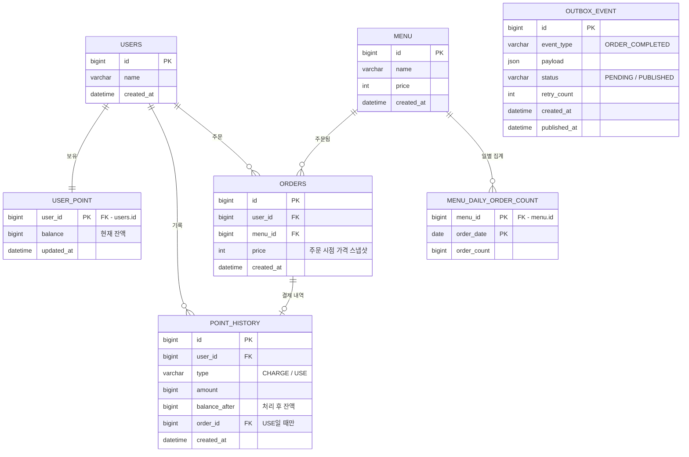

# ☕ 커피숍 주문 시스템
다수 서버 환경에서도 안정적으로 동작하는 커피 주문 시스템입니다.

## 0. 문제 해결 전략 수립
### 0-1. 요구사항 분석

<b>모든 기능에 공통으로 적용되는 전제</b>
> **"애플리케이션 서버는 여러 대가 동시에 뜬다."**
> 따라서 `synchronized`, 서버 메모리 변수, 로컬 캐시처럼 **한 JVM 안에서만 유효한 수단으로는 정합성을 보장할 수 없습니다.**
> 정합성의 기준(Single Source of Truth)은 모든 서버가 공유하는 **DB**로 둡니다.

**"무엇이 깨지면 안 되는가"**
| 기능 | 깨지면 안 되는 것 | 핵심 위험 |
|---|---|---|
| 메뉴 목록 조회 | 모든 서버가 같은 메뉴를 보여줘야 함 | 서버별 로컬 캐시 불일치 |
| 포인트 충전 | 충전한 만큼 정확히 늘어나야 함 | 동시 충전 시 Lost Update, 중복 요청 |
| 주문/결제 | 잔액 이상 결제 불가, 결제와 주문은 함께 성공/실패 | 동시 주문 시 잔액 초과 차감, 부분 실패 |
| 데이터 플랫폼 전송 | 커밋된 주문만, 빠짐없이 전송 | 롤백된 주문 전송, 전송 실패로 인한 유실 |
| 인기 메뉴 조회 | 주문 횟수가 정확해야 함 | 집계 누락/중복, 대용량 집계 쿼리 부하 |

### 0-2. 설계 내용
 
#### ERD
 

